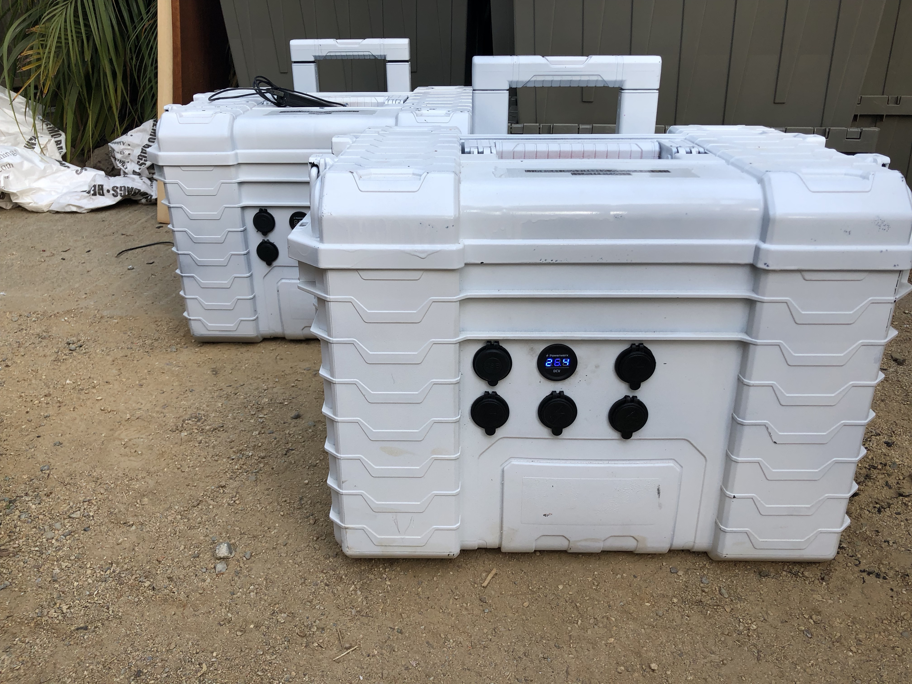
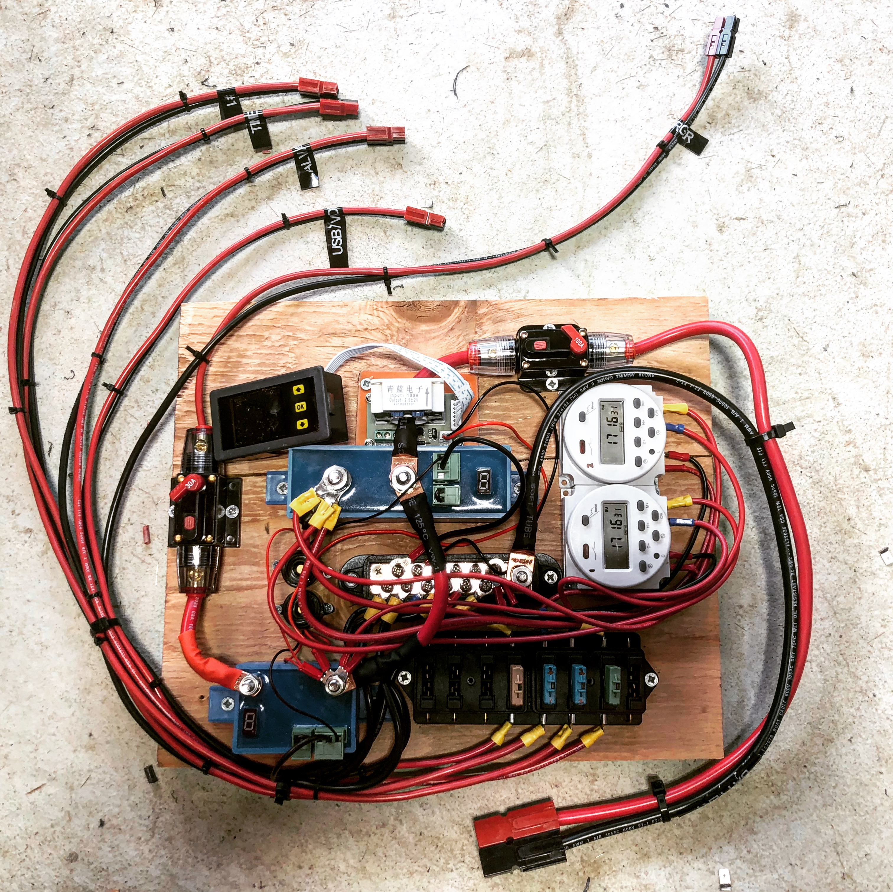
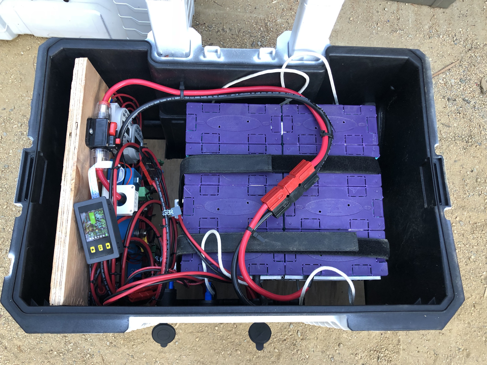
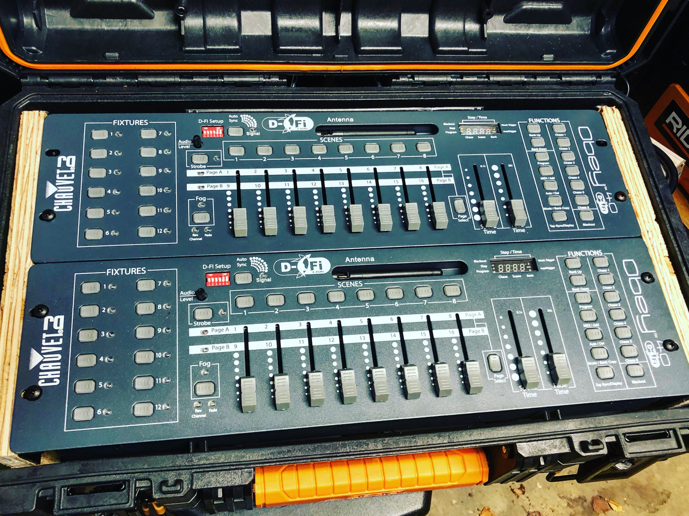

# Arc
A nifty way to build modular off grid solar power systems.

## Overview
This system was primarily designed to provide 30kwh of daily capacity for our Burning Man camp. It provides 25.6vdc electricity because we have found that to be best compromise in terms of energy efficency and appliance requirements. 25.6vdc also allows for longer cable runs then for example 12vdc.

Given that it is not a super common standart (vs. 110-220vac) we also started to design custom appliances that benefit from it by being oders of magnitude more efficent than off the shelf solutions.

### Advantages:
* Cheaper than off the shelf solutions
* No off season maintenance required
* Outdoor (Playa) proof
* Easy to extend vertically (by adding more Arc's)
* Highly power efficent

### Appliance types we run:
* Lights (24vdc LED fixtures)
* PA System (we currentely run a custom 2kw RMS PA and are planning to expand to 6kw this year)
* Fridges (there is a bunch of 24v fridges available on the market)
* Water pumps (there is a bunch of 24v fridges available on the market)
* Various low voltage (5-12vdc) appliances such as DMX controllers, wifi access points, ipads, etc. (those can easily be fed by using step down voltage converters)

## Features
* 2x 15a Always on outlet with breakers
* 4x 15a Timer controller outlets with breakers
* 2x USB outlets with breaker
* 1x External system voltage display
* 1x 30a charge inlet with breaker and overcharge protection
* Battery cell load balancing
* Under charge protection
* Under/over voltage protection
* Smart system monitoring cpu

## System Architecture
The system is designed to consist of multiple independend units which allows for simpler deployment across the perimeter, reduced complexity and higher redundancy.

For added flexibility we seperated the battery and controller from the solar charge controller because for some usecases (single day events) we don't need the solar piece (Arcs can also be charged from the regualr power grid).

We run 7x Arcs for our camp at this time. Each one of them has 2,560kwh storage capacity for a total of 17,920kwh. Each is charged by two 350w solar panels.

## Arc components
On a high level each arc consists of two modules:
* Arc itself
  * Battery
  * Battery management controller
  * Timers (to automatically control lights at night)
  * Housing with outlets
* Solar charger
  * Solar charge controller
  * Breakers
  * System management interface
  * housing

[Arc v2 parts list](arc_v2_parts_list.csv)

## Housing
Housing needed to be highly mobile, robust, water proof and cheap. Hence we decided to use Ridgid Toolboxes which can be easily purchased at any HomeDepot. They are also stackable!

These toolboxes also fit 19" components which comes in handy to house industry standart rack mount gear.

## Cables
Using a system voltage of 25.6vdc allows for long cable runs using 12AWG cable.

Example: A 75ft long 12AWG cable can support a load up to 100w!

[Cable length table](cable_length_table.csv)

## Connectors
Based on previous expierence we decided to use pp45 Anderson Powerpole connectors which support up to 45amp loads and a bi-directional.

## Known issues
* When the battery get completely drained sometimes the charger controller won't come on in the morning and needs a power cycle to correctly read the abttery status

## Todo's
* Simplify status monitoring
* Simplify tracking down and fixing issues
* Maximize hardware utilization (timers are ok, but a dynamic system would be better)
* Simplify assembly and reduce costs
* Mass manufacturable
* Inter arc load balancing

## Thanks
* Mark Omerod for starting this project in 2015
* Kuy Mainwaring for being part of the brain trust around this over the years
* Drew Moxon for really being the man enabling me and my silly ideas
* All the amazing souls at Hotel California for making this happen

## License
Copyright (c) 2017-2019 Matthias Wagner

## Safety Disclaimer
This project and the material covered is for informational purposes only. We take no responsibility for what you do with this knowledge. We can not be held responsible for any property or medical damages caused by items you read about here. We would advise you to check your local laws. Some of the items we refer to are illegal in some areas, and we would highly advise you against building these in said areas.

The material is for informational purposes only. By taking any information or education material, you assume all risks for the material covered. You agree to indemnify, hold harmless, and defend this project from any and all claims and damages as a result of any and all of the information covered.

By taking and/or using any informational resources from this project, you agree that you will use this information in a safe and legal manner, consistent with all applicable laws, safety rules, and good common sense. You further agree that you will take such steps as may be reasonably necessary or required by applicable law to keep any information out of the hands of minors and untrained and/ or immature individuals.
